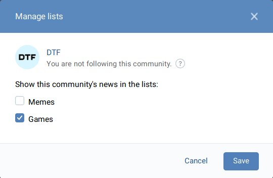

# VK.com List Add

[🇷🇺 По-русски →](/README.ru.md)

> This userscripts add button on communities pages to add them to the feed lists (tabs) without even subscribing to them.

    

## How do I use it?

First you need to install this script using preferred userscript manager extension (like [Tampermonkey](https://www.tampermonkey.net/), [Greasemonkey](https://www.greasespot.net/), [Violentmonkey](https://violentmonkey.github.io/)). Pressing the following button will open an installation window.

After installation, reload VK.com pages. Now on any community pages you will see black “Manage lists” button, it opens a dialog to add community to the lists. You may create lists at the [News page](https://vk.com/feed) by using “+” button near News tab.

## Legitimacy

Creating and managing lists and even having communities in them without following them is absolutely legit. However use of this script is at your risk, it relies on internal site's API, so may either break on new updates to VK or break site itself. In generally, everything this script does can be done manually, it just simplifies the process as much as possible.

## Reporting issues

If userscript not working correctly or you have questions about it, please use [Issues section →](https://github.com/Sasha-Sorokin/vklistadd/issues)
