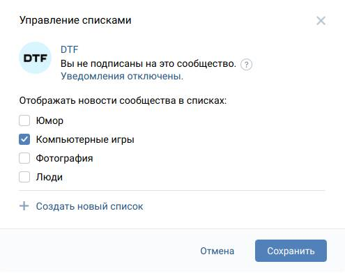

# VK List Add

> Удобное добавление в списки новостей

🇺🇸 This page is available [in English →](/docs/en-US/README.md)

## ❔ Что это?

VK List Add — это юзерскрипт, который позволяет с максимальной простотой
добавлять сообщества или пользователей в свои списки (вкладки) новостей
ВКонтакте. В том числе и без подписки!

  

## ⚡️ Как установить?

Юзерскрипты — это маленькие дополнения для определённых сайтов. Для их
установки требуется специальное расширение-менеджер, которое позволяет
ими управлять, оно же следит, чтобы они загружались на нужных сайтах,
хранит настройки и так далее.

В качестве такого расширения подойдут: [Tampermonkey][tamper] и
[Violentmonkey][violent]. К сожалению, оригинальный **Greasemonkey не
поддерживается**.

Ставьте менеджер и нажимайте следующую кнопку — она откроет окно установки:

[![Установить VK List Add][badge]][script_link]

[tamper]: https://www.tampermonkey.net/
[violent]: https://violentmonkey.github.io/
[badge]: https://img.shields.io/badge/VK%20List%20Add-%D0%A3%D1%81%D1%82%D0%B0%D0%BD%D0%BE%D0%B2%D0%B8%D1%82%D1%8C-brightgreen
[script_link]: https://github.com/Sasha-Sorokin/vklistadd/raw/master/dist/vklistadd.user.js

## 📕 Как пользоваться?

Мы написали подробную документацию, чтобы вам было проще научиться
пользоваться этим скриптом, [заходите и читайте →][guide]

[guide]: /docs/ru-RU/GUIDE.md

## 👀 А это не опасно?

Данный скрипт не добавляет никакие приложения без вашего ведома, он использует
исключительно внутренние API сайта. Мы также пытаемся не отправлять лишних
запросов, когда то не требуется — например, вы повторно открыли окно списков.

Мы не можем давать никаких гарантий, поэтому вы используете этот скрипт на
свой риск: если ВКонтакте резко изменит сайт, то скрипт может помешать его
работоспособности, однако вы всегда можете его отключить или удалить.

В целом, всё, что делает этот скрипт, можно сделать вручную, он просто в разы
упрощает этот процесс.

## 🐞 Сообщения об ошибках

Если скрипт не работает или у вас имеются вопросы, используйте
[секцию Issues →][issues]

[issues]: https://github.com/Sasha-Sorokin/vklistadd/issues

## 💝 Поддержка

Написание подобных скриптом требует времени и сил. Вы можете выразить свою
благодарность автору одним из следующих способов:

- 🌟 Поставьте звёздочку этому репозиторию, чтобы его увидело больше людей
- 💬 Поделитесь этим скриптом со своими друзьями: возможно он будет им полезен
- 🧩 Посмотрите мои другие скрипты:
  - [Интеграция Яндекс.Музыки с MSA][msa1]: интегрируйте музыку ближе к системе
  - [Та же интеграция, но для Музыки ВКонтакте][msa2]
  - [Вкладки вкладками ВКонтакте][tabs]: верните приятный кусочек прошлого
- 💸 Поддержите меня [копейкой на Яндекс.Деньги][yamoney]

[msa1]:https://github.com/Sasha-Sorokin/ymusic_msa
[msa2]: https://github.com/Sasha-Sorokin/vkaintegra
[tabs]: https://github.com/Sasha-Sorokin/vktabbytabs
[yamoney]: https://money.yandex.ru/to/410014746904198

## 💕 Признательность

Этот проект использует такие крутые штуки, как:

- [Минималистичную React-like библиотеку — Preact][preact]

  Благодаря этой библиотеке у нас очень быстрый и отзывчивый интерфейс, а его
  написание превращается в приятное развлечение (без шуток, это здорово!).

- [simplestyle-js для стилизации элементов интерфейса][simplestyle]

  Мы попытались воспроизвести максимально подобный ВКонтакте интерфейс, чтобы
  вам было намного привычнее использовать скрипт. При помощи simplestyle мы
  можем это делать быстро и просто, без лишнего кода.
- [Строгость TypeScript][typescript]

  TypeScript добавляет в JavaScript понятие типизации, благодаря чему многие
  ошибки можно отловить ещё на стадии сборки скрипта, а написание кода
  становится существенно проще.
- [Сборщик Rollup.js][rollup]

  Rollup позволяет нам разделить кодовую базу на компоненты и модули, а потом
  собрать их в один единственный файл — скрипт, который вы используете. Он
  не просто объединяет файлы, но и преобразует иконки и тексты.
- [Множество других библиотек — все не перечислишь!][package]

  Благодаря открытым исходным кодам творить такие вещи становится очень
  интересно и просто. Спасибо всем, кто работает над такими проектами <3

- Ну и конечно — [ВКонтакте][vk_about]

  Спасибо за полу-открытое API, намерено это или нет. Вы даёте стороним людям
  возможность безгранично расширять ваш сайт, помогать остальным пользователям
  и при этом оттачивать свои навыки.

  ВКонтакте ищет талантливых разработчиков в свою команду, смотрите [открытые
  вакансии на сайте][vk_jobs]

[preact]: https://preactjs.com/
[simplestyle]: https://github.com/benduran/simplestyle
[typescript]: https://www.typescriptlang.org/
[rollup]: https://github.com/rollup/rollup
[package]: /package.json
[vk_about]: https://vk.com/about
[vk_jobs]: https://vk.com/jobs
