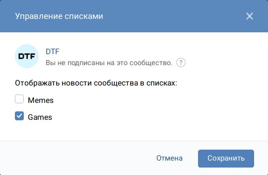

# VK.com List Add

> Этот юзерскрипт добавляет кнопку на страницах сообществах, которая позволяет добавлять их в списки (вкладки) новостей, в том числе и без подписки.

    

## Как этим пользоваться?

Первым делом вам нужно будет установить этот скрипт через предпочтительное расширение (типа [Tampermonkey](https://www.tampermonkey.net/), [Greasemonkey](https://www.greasespot.net/) или [Violentmonkey](https://violentmonkey.github.io/)). Нажатие следующей кнопки откроет окно установки:

Перезагрузите страницы ВК после установки. Теперь на страницах сообществ вы можете найти чёрную кнопку «Настроить списки», которая открывает диалог добавления сообщества в списки. Сами списки можно создавать на [странице Новости](https://vk.com/feed), подробная [инструкция в сообществе LIVE →](https://vk.com/page-2158488_53570088)

## Легитимность

Создание и управления списками и даже наличие сообществ там без подписки на них — абсолютно легитимно. Однако использование этого расширение на ваш риск: оно зависит от внутренних API сайта, так что может сломаться при очередном обновлении или даже сломать сам сайт. В целом, всё, что делает этот скрипт, можно сделать вручную, он просто в разы упрощает этот процесс.

## Сообщения об ошибках

Если юзерскрипт не работает или у вас есть вопросы, используйте [секцию Issues →](https://github.com/Sasha-Sorokin/vklistadd/issues)
