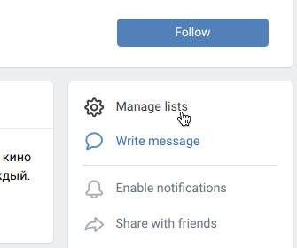
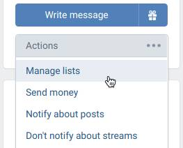

# How to use VK List Add?

VK List Add gives you a convenient and simple way to add communities and users
to your own news feed lists. Managing menu can be called in multiple contexts:
on the page of a community or user, in bookmarks or communities list.

Table of contents

-   [How to use VK List Add?](#how-to-use-vk-list-add)
    -   [Adding to the lists](#adding-to-the-lists)
        -   [On the page of a community](#on-the-page-of-a-community)
        -   [On the user's page](#on-the-users-page)
        -   [Through the communities list](#through-the-communities-list)
        -   [Through the friends lists](#through-the-friends-lists)
        -   [Through the bookmarks](#through-the-bookmarks)
    -   [Managing lists](#managing-lists)
    -   [This is all](#this-is-all)
    

## Adding to the lists

### On the page of a community

To add community to one of your lists, visit its page. We've moved the option
to at the top of actions block right next to community avatar, so you will
never lose or forget about it.

  

### On the user's page

On communities pages we couldn't find any ways to integrate this option so it
wouldn't draft too much attention. So we decided to put it in actions menu.

Press a button with ellipsis right next to avatar and use “Manage lists”
menu option.

  

### Through the communities list

Navigate to communities page and find needed community, hover mouse over
ellipsis button on the right side. In the displayed menu, use option “News feed
lists”. It's that simple!

### Through the friends lists

You can already manage friend lists, why won't we have the same thing for
news feed lists. That's why we implemented so that you can actually do it.

Just head over to your friend lists and as with communities, hover over
ellipsis button on the right, there you'll find that one option.

### Through the bookmarks

Unfortunately, using a mobile device you cannot change your lists. To simplify
your life, you can save interesting communities or users to your bookmarks to
add them to your none less interesting lists later back on computer.

Navigate to bookmarks page and hover over bookmark, then move mouse to the
gray bubble with ellipsis icon. In displayed menu, search for option ”News
feed lists”.

Worth a note that this only works in “People” and “Communities” categories.

## Managing lists

When you press an option to manage lists, a box will show up. Your lists are
being loaded in background, when they do load, they will be displayed as
checkboxes. Toggle those that you want to see user's or page's news in.

After toggling lists, press ”Save” button. The box will hide after saving
the changes. However, want you to leave a box to double check lists you
toggled, just hold Shift key when pressing a button — the box will stay open.
Cool, isn't it? :)

If you didn't find a list you need, for your convience, we've added a special
link ”Create a new list” — it will redirect you to the news page and then
will automatically open a list creation box.

What's unique to that button?

1. First: it automatically scrolls list of your follows and friends to the
   needed community or user. No fussing around and very useful, have you
   more than ten of friends.
2. Second: in case you forgot or don't want to follow that community or user,
   they are still will be showed in the lists. Yes, we've went ahead and add
   them for you.

## This is all

We hope that this extension will be useful to you. You're welcome :)

If you want, you can [support its developers →](README.md#-support)
