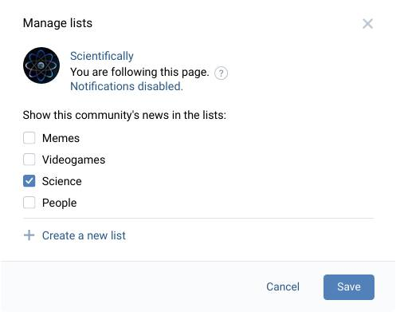

# VK List Add

> A convient way to sort people and communities into news feed lists

## ❔ What is it?

VK List Add — is an userscript, which provides you a stupid simple way to add
communities and users to your own news feed lists (or “tabs”) on VK. Even
without subscribing to any of them!

  

## ⚡️ How to install it?

Userscripts are small extensions for specific sites. In order to install these
you have to have a special managing browser extension which would load them on
these specific sites, stores their settings and so on.

Best choices are: [Tampermonkey][tamper] and [Violentmonkey][violent].
Unfortunately, original **Greasemonkey is not supported**.

Install a manager and use the following button — it opens installation window:

[![Install VK List Add][badge]][script_link]

[tamper]: https://www.tampermonkey.net/
[violent]: https://violentmonkey.github.io/
[badge]: https://img.shields.io/badge/VK%20List%20Add-%D0%A3%D1%81%D1%82%D0%B0%D0%BD%D0%BE%D0%B2%D0%B8%D1%82%D1%8C-brightgreen
[script_link]: https://github.com/Sasha-Sorokin/vklistadd/raw/master/dist/vklistadd.user.js

## 📕 How to use it?

We wrote a detailed documentation on that, so you can quickly learn on how
to use this script, [go on and read it →][guide]

[guide]: ./GUIDE.md

## 👀 Is this safe to use?

This script doesn't add any applications on your behalf and uses only internal
site's APIs. We also trying not to send excessive requests, when it's
unnecessary (e.g. when you reopen the same window).

We cannot give any warranties, though, so you are using this at your risk:
though low chances, but if VK changes something, this script may break some
of the site's function, but you can always disable or uninstall it.

Anyway, all this script does can be replicated manually, though it makes that
process a few times simpler.

## 🐞 Bug reports

If script won't work correctly or you have any questions, please use
[Issues section →][issues]

[issues]: https://github.com/Sasha-Sorokin/vklistadd/issues

## 💝 Support

Writting these scripts uses time and strength. You can show your appreciation
to the author through the following methods:

-   🌟 Leave a star on this repository, so more people can see it
-   💬 Share this script with your VK friends: it could find some use among them
-   🧩 See some of my other scripts:
    -   [Yandex.Music MSA integration][msa1]: integrate music closer to the system
    -   [Same integration, but for VK][msa2]
    -   [VK Tabby Tabs][tabs]: show news feed lists as tabs
-   💸 Support me by sending [a few cents via Yandex.Money][yamoney]

[msa1]: https://github.com/Sasha-Sorokin/ymusic_msa
[msa2]: https://github.com/Sasha-Sorokin/vkaintegra
[tabs]: https://github.com/Sasha-Sorokin/vktabbytabs
[yamoney]: https://money.yandex.ru/to/410014746904198

## 💕 Acknowledgments

This project uses some cool things, such as:

-   [Minimal React-like library — Preact][preact]

    Thanks to this library we can have a quick and responsive UI and writing
    it becomes a big joy (no sarcasm indeed, this is really cool!).

-   [simplestyle-js to style our UI components][simplestyle]

    We tried to replicate the exact look of VK UI in our components so it would
    more natively integrate in your VK experience. By using simplestyle we can
    do it a lot faster, yet comfortable without much of the code.

-   [Strictness of TypeScript][typescript]

    TypeScript adds defenition of types to JavaScript and thanks to this, we are
    able to catch many mistakes while building the script and writing code
    becomes a lot easier.

-   [Rollup.js bundler][rollup]

    Rollup allows us to split codebase into multiple components and moudles and
    then compile all of it into a single file — the script you would use. It's
    not just bundles that all, but also converts icons and texts for us.

-   [Many other libraries — you can't count them all!][package]

    Thanks to open source, creating such things because a very interesting and
    creative, yet easy task. Thanks to everyone who works on open source <3

-   And last of all, of course — [to VK][vk_about]

    Thank you for half-exposed API, specially or not. You give other people a
    possibilty to infinitely extend your site, help other users and grow your
    skills by doing so.

    VK is currently hiring developers, though highly probably with Russian
    knowledge only. [See job openings here →][vk_jobs]

[preact]: https://preactjs.com/
[simplestyle]: https://github.com/benduran/simplestyle
[typescript]: https://www.typescriptlang.org/
[rollup]: https://github.com/rollup/rollup
[package]: /package.json
[vk_about]: https://vk.com/about
[vk_jobs]: https://vk.com/jobs
