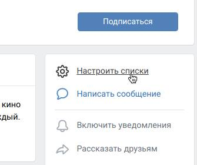
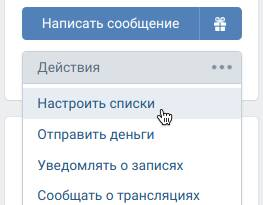

# Как использовать VK List Add?

VK List Add позволяет удобно и просто добавлять сообщества и пользователей
в списки новостей. Вызвать меню добавления в списки можно сразу в нескольких
контекстах: на самой странице группы/пользователя, в закладках или в списке
сообществ.

## Добавление в списки

### На странице сообщества

Для добавления сообщества в один из своих списков новостей, перейдите на
его страницу. Чтобы вы не забывали и не теряли эту опцию, мы поместили её
на самый верх блока действий, которой находится справа под аватаркой.

  

### На странице пользователя

На странице пользователей мы не нашли способов интегрировать опцию так, чтобы
не привлекать излишнего внимания. Поэтому мы добавили эту опцию в меню действий.

Нажмите на кнопку с многоточием под аватаркой и выберите в меню «Настроить
списки».

  

### Через список сообществ

Перейдите на страницу своих сообществ и найдите нужное сообщество, наведите
мышку на многоточие справа. В отобразившемся меню найдите опцию «Настроить
списки». Вот так вот просто!

### Через закладки

К сожалению, на мобильных устройствах добавлять в списки нельзя. Поэтому,
чтобы упростить вам жизнь, вы можете сохранять интересные сообщества и
пользователей в своих закладках, чтобы позже внести их в свои не менее
интересные списки.

Перейдите на страницу своих закладок, наведите на закладку и затем переведите
мышку на появившееся многоточие в сером кружке. В отобразившемся меню ищите
привычную опцию «Настроить списки».

Стоит отметить: работает эта опция только в категориях «Люди» и «Сообщества».

## Управление списками

При нажатии на опцию «Настроить списки», откроется окошко. Ваши списки
загрузятся в фоне и сразу же отобразятся в виде флажков. Установите флажки
напротив списков, в которых вы хотели бы видеть новости сообщества или
пользователя.

После выбора нужных списков, нажмите кнопку «Сохранить». Окошко автоматически
закроется после сохранения изменений. Однако, если вы хотите всё проверить,
просто зажмите кнопку Shift и тогда окошко останется на месте. Здорово? :)

Если вы не нашли нужного списка, для максимального удобства, мы добавили
специальную ссылку «Создать список»: она перенаправляет вас на страницу
новостей и автоматически откроет для вас окошко создания списка.

Что уникального в этой кнопке?

1. Во-первых, она автоматически прокрутит список всех ваших подписок и друзей
   к нужному сообществу или пользователю. Никакой возни и очень полезно, если
   у вас десятки подписок и друзей.
2. Во-вторых, если вы забыли или не захотели подписываться на сообщество
   или пользователя, он(о) всё равно отобразится в этом списке: всё верно,
   мы пошли немного дальше и дополняем этот список автоматически.

## Это всё!

Надеемся, это расширение окажется очень полезным для вас. Используйте на
здоровье. А если захотите — можете [поддержать его разработчиков →](/README.md#-поддержка)
